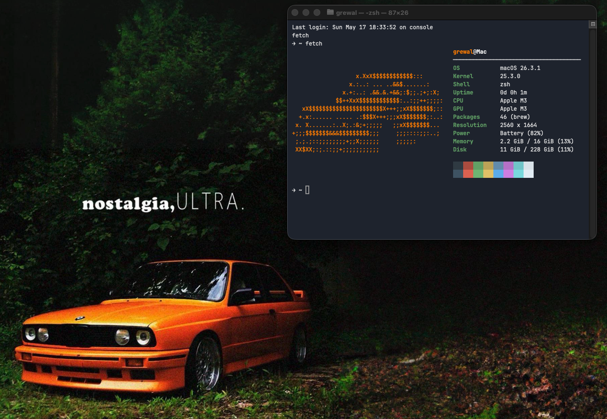

# fetch

> A custom macOS system fetch script. Displays system info alongside ASCII art every time you open a terminal.



---

## What it shows

- OS, Kernel, Shell
- Uptime, CPU, GPU
- Packages (brew)
- Resolution, Power
- Memory & Disk usage with percentages
- Terminal color swatches

---

## Requirements

- macOS
- [Homebrew](https://brew.sh) (optional, for package count)

---

## Installation

**1. Clone or download this repo**

```bash
git clone https://github.com/yourname/fetch.git
cd fetch
```

**2. Run the installer**

```bash
bash install.sh
```

That's it. The installer will:

- Copy `fetch` to `/usr/local/bin` so you can run it from anywhere
- Add `fetch` to your `~/.zshrc` so it runs automatically every time you open a terminal

---

## Manual installation

If you'd rather do it yourself:

```bash
sudo cp fetch.sh /usr/local/bin/fetch
sudo chmod +x /usr/local/bin/fetch
echo "fetch" >> ~/.zshrc
source ~/.zshrc
```

---

## Usage

Just open a terminal. Or run it manually:

```bash
fetch
```

---

## Customization

All the info functions are at the top of `fetch.sh`. You can add, remove, or reorder any field in the `info` array inside `main()`. The ASCII art lives in `print_ascii()` — swap it out with anything you want.
